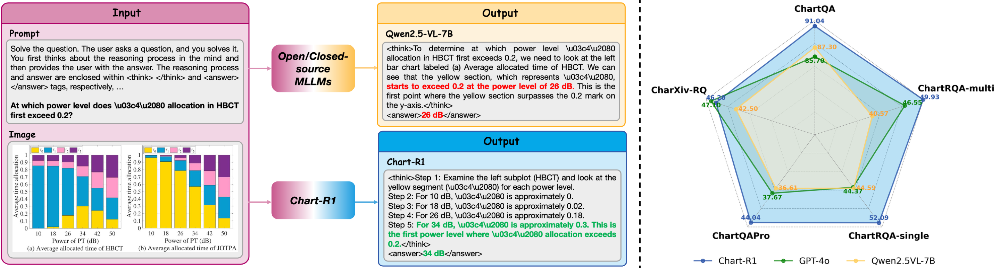

<div style="display: flex; align-items: center;">
  <h1>Chart-R1: Chain-of-Thought Supervision and Reinforcement for Advanced Chart Reasoner</h1>
</div>

<div align="center">
Lei Chen, Xuanle Zhao, Zhixiong Zeng†, Jing Huang, Yufeng Zhong, Lin Ma*
</div>
<div align="center">
<strong>Meituan Group</strong>
</div>
<div align="center">
† Project Leader; * Corresponding Author
</div>


---
**Chart-R1** is a vision-language model that enables complex chart reasoning through reinforcement learning fine-tuning. As the **first** to apply R1-Style methods to the chart domain, it employs programmatic data synthesis to generate high-quality step-by-step reasoning data for charts. Chart-R1's two-stage training includes Chart-COT (chain-of-thought supervision) and Chart-RFT (numerically sensitive reinforcement fine-tuning). Experiments show Chart-R1 achieves significant advantages on open-source benchmarks and the ChartRQA dataset, comparable to large-scale models like GPT-4o and Claude-3.5, proving R1-Style effectiveness for chart reasoning.
<div align="center">

</div>

## News and Updates
* ```2025.07.21``` 🔥🔥🔥 We release the technical report of **Chart-R1** at arXiv [link](https://arxiv.org/abs/2507.15509).

## Performance
<table>
<thead>
  <tr>
    <th rowspan="3"></th>
    <th rowspan="3">Model Name</th>
    <th colspan="5">Chart Reasoning Benchmarks</th>
  </tr>
  <tr>
    <th rowspan="2">ChartQA</th>
    <th rowspan="2">CharXiv-RQ</th>
    <th rowspan="2">ChartQAPro</th>
    <th colspan="2">ChartRQA</th>
  </tr>
  <tr>
    <th>single</th>
    <th>multi</th>
  </tr>
</thead>
<tbody>
  <tr>
    <td rowspan="5">Proprietary</td>
    <td>GPT-4o</td>
    <td>85.7</td>
    <td>47.1</td>
    <td>37.67</td>
    <td>44.37</td>
    <td>46.55</td>
  </tr>
  <tr>
    <td>Gemini-1.5-Flash</td>
    <td>79.0</td>
    <td>33.9</td>
    <td>42.96</td>
    <td>-</td>
    <td>-</td>
  </tr>
  <tr>
    <td>Gemini-1.5-Pro</td>
    <td>87.2</td>
    <td>43.3</td>
    <td>-</td>
    <td>-</td>
    <td>-</td>
  </tr>
  <tr>
    <td>Gemini-2.5-Flash</td>
    <td>-</td>
    <td>-</td>
    <td>-</td>
    <td>59.12</td>
    <td>59.17</td>
  </tr>
  <tr>
    <td>Claude-3.5-Sonnet</td>
    <td>90.8</td>
    <td>60.2</td>
    <td>43.58</td>
    <td>-</td>
    <td>-</td>
  </tr>
  <tr>
    <td rowspan="3">General-domain Open-source</td>
    <td>InternVL3-8B</td>
    <td>86.6</td>
    <td>37.6</td>
    <td>-</td>
    <td>-</td>
    <td>-</td>
  </tr>
  <tr>
    <td>InternVL3-38B</td>
    <td>89.2</td>
    <td>46.4</td>
    <td>-</td>
    <td>-</td>
    <td>-</td>
  </tr>
  <tr>
    <td>Qwen2.5-VL-7B</td>
    <td>87.3</td>
    <td>42.5</td>
    <td>36.61</td>
    <td>44.59</td>
    <td>40.57</td>
  </tr>
  <tr>
    <td rowspan="5">Chart-domain</td>
    <td>ChartLlama</td>
    <td>69.66</td>
    <td>14.2</td>
    <td>-</td>
    <td>-</td>
    <td>-</td>
  </tr>
  <tr>
    <td>TinyChart</td>
    <td>83.60</td>
    <td>8.3</td>
    <td>13.25</td>
    <td>6.75</td>
    <td>6.11</td>
  </tr>
  <tr>
    <td>ChartGemma</td>
    <td>80.16</td>
    <td>12.5</td>
    <td>6.84</td>
    <td>-</td>
    <td>-</td>
  </tr>
  <tr>
    <td>ChartReasoner</td>
    <td>86.93</td>
    <td>-</td>
    <td>39.97</td>
    <td>-</td>
    <td>-</td>
  </tr>
  <tr>
    <td><b>Chart-R1-7B (Ours)</b></td>
    <td><b>91.04</b></td>
    <td><b>46.2</b></td>
    <td><b>44.04</b></td>
    <td><b>52.09</b></td>
    <td><b>49.93</b></td>
  </tr>
</tbody>
</table>


## Citation
If you find this project useful, please feel free to leave a star and cite our paper:
```
@misc{chen2025chartr1chainofthoughtsupervisionreinforcement,
      title={Chart-R1: Chain-of-Thought Supervision and Reinforcement for Advanced Chart Reasoner}, 
      author={Lei Chen and Xuanle Zhao and Zhixiong Zeng and Jing Huang and Yufeng Zhong and Lin Ma},
      year={2025},
      eprint={2507.15509},
      archivePrefix={arXiv},
      primaryClass={cs.AI},
      url={https://arxiv.org/abs/2507.15509}, 
}
```
